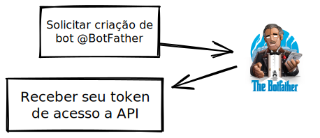
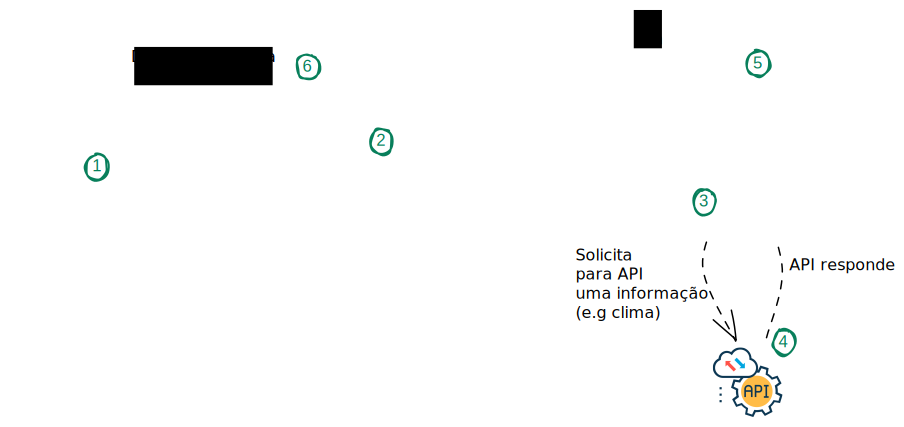
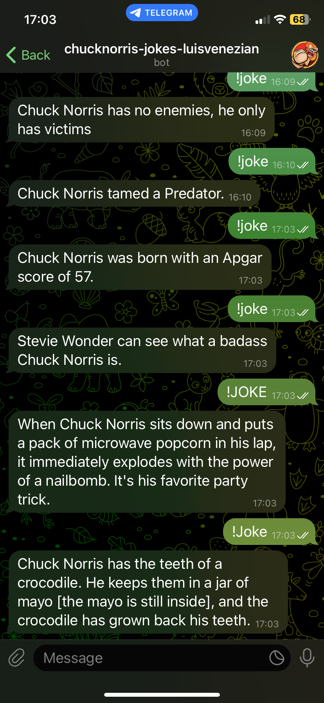

# Bot para Telegram

Nesse desafio a intenção é que você desenvolva um bot para Telegram utilizando a linguagem Python, esse cenário vai te colocar em prova com algumas demandas importantes de um programador, que vão além da capacidade de codificação: entender arquiteturas e saber como acoplar os pedaços para realizar uma tarefa desejada. O projeto é livre, e você poderá usar sua criatividade para novas funcionalidades para seu bot.

### O que fará esse bot?
A ideia é criar um bot que seja capaz de interpretar suas mensagens enviadas ao telegram para criar uma resposta personalizada, seja ela uma simples piada, como o exemplo a seguir, ou até uma informação relevante como a previsão do tempo.

### Direcionamento para o desenvolvedor
1- Crie um bot através do bot BotFather, do Telegram, ele é um super bot, pai de todos os outros da plataforma, é também através dele que você poderá personalizar uma série funções da sua criação. Veja mais detalhes na documentação oficial: https://core.telegram.org/bots/features#botfather   
   
2- Com token de acesso em mãos é hora de codificar sua solução! Use exemplos da internet para tomar como base e use também essa documentação com o tutorial da criação de um bot em Java: https://core.telegram.org/bots/tutorial, mas fique tranquilo, apesar da documentação estar em Java há também um exemplo de código fornecido em [Python](https://gitlab.com/Athamaxy/telegram-bot-tutorial/-/blob/main/TutorialBot.py)!   
3- Para não se perder e conferir se está no caminho certo confira o diagrama de funcionamento da aplicação:   
   

### O bot deve atender aos seguintes requisitos:
* Usuários devem ser capazes de adicionar seu bot ao telegram deles
* O bot deve ser capaz de ler as entradas de dados do usuario
* O bot deve entender mensagens começando com "!" como comandos (você também pode personalizar esse padrão se quiser)
* Integre o bot com uma API de sua escolha. Sugestoes: [Chuck Norris](https://api.chucknorris.io/)/[OpenWeather](https://openweathermap.org/api).
### Dicas
Para realizar essa atividade com tranquilidade você deve estar familiarizado com: 
* A realização de requisições HTTP em API como GET/POST, via Python esse procedimento é resolvido majoritariamente com a bilioteca `requests`.
* A manipulação de dicionários
* Noções de arquitetura de código com orientação a objetos
* REGEX (Apenas o necessário para configurar o padrão "!" nas mensagens)

### Comentário
Esse projeto é livre, e não existe nada te limitando: suas escolhas vão definir o quão difícil vai ser esse projeto, podendo ir da dificuldade mamão com açúcar até ultra hard. Todas as pessoas têm um ponto diferente para sair da zona de conforto, e esse ponto também muda conforme seu domínio sobre o tópico aumenta. Encontre o que te faz sair da zona de conforto e deixe o projeto mais difícil. Pesquise API's diferentes, melhores praticas de orientação a objetos, otimização de código, etc. 

## Exemplo
No final do desenvolvimento você deve ter uma aplicação que interage com o bot de acordo com a figura abaixo:   

